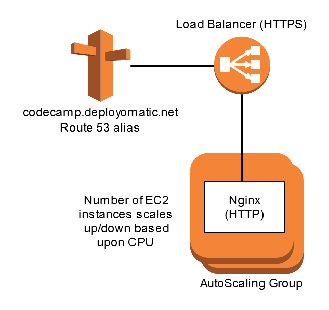

# CodeCamp CloudFormation examples

https://github.com/andrewdmay/codecamp-cloudformation

## Messaging example

Two SQS Queues subscribe to an SNS Topic with both Queues receiving a copy of all messages sent to the Topic.

Queues are configured with Dead Letter Queues where messages that have been read and not deleted multiple times will be sent.

### Templates

The templates would normally evolve as commits to the same file, but to make it easier to compare there are separate files in this example.

* messaging-1.yml - Creates the Topic
* messaging-2.yml - Creates first Queue and subscribes to the Topic; includes Queue Policy
* messaging-3.yml - Adds DLQ to first Queue
* messaging-final.yml - Adds second queue and subscribes to Queue using separate subscription resource

## AutoScaling example

AutoScaling Group that runs 2 or more Nginx servers configured dynamically at start-up running behind a "Classic" Elastic Load Balancer
that provides TLS termination using an AWS created Certificate.

Nginx servers are configured using CloudFormat::Init from a standard Amazon Linux AMI. Nginx is installed and configured (index.html) and the service started.

A Route53 alias is created for the ELB that matches the domain name in the certificate.

CloudWatch alarms are used to scale the AutoScaling Group size up or down based upon average CPU.

## Useful Links

* [Template Anatomy](http://docs.aws.amazon.com/AWSCloudFormation/latest/UserGuide/template-anatomy.html)
* [Template Reference](http://docs.aws.amazon.com/AWSCloudFormation/latest/UserGuide/template-reference.html)
